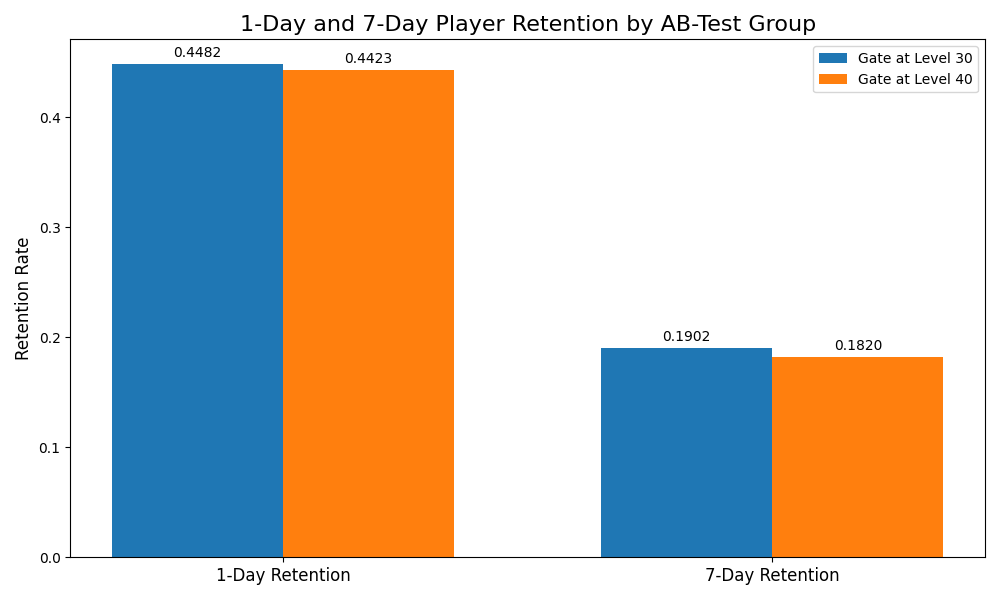

# Cookie Cats A/B Test: An Analysis of Player Retention

### Business Problem & Objective

Cookie Cats, a popular mobile game, uses "gates" that force players to wait a certain amount of time before progressing. The company ran an A/B test to evaluate the impact of moving the first gate from level 30 to level 40.

The objective of this analysis is to determine which gate placement leads to higher player retention and provide a data-driven recommendation on which version to implement.

### Key Findings

The analysis reveals a statistically significant decrease in player retention when the gate is moved from level 30 to level 40. The 7-day retention metric, a key indicator of long-term player engagement, is most affected.

* **1-Day Retention:** The `gate_30` group had a retention rate of **44.8%**, while the `gate_40` group had a rate of **44.2%**. This difference is statistically significant (p < 0.05).

* **7-Day Retention:** The `gate_30` group had a retention rate of **19.0%**, compared to **18.2%** for the `gate_40` group—a drop of nearly 1 percentage point. This difference is highly statistically significant (p < 0.001).

### Analysis & Methodology

The analysis was conducted in Python using the pandas and NumPy libraries for data manipulation and Matplotlib for visualization. The core of the analysis followed three steps:

1. **Data Grouping:** The dataset was first grouped by the two test versions (`gate_30` and `gate_40`) to calculate the raw mean retention rates for 1-day and 7-day periods.

2. **Statistical Significance Testing:** To determine if the observed difference in means was statistically significant, a **bootstrapping** simulation was performed. This involved resampling the data 5,000-10,000 times for each version to generate a distribution of possible mean differences.

3. **P-Value Calculation:** The p-value was then calculated from the bootstrap distribution, representing the probability of observing the difference we saw (or a more extreme one) if the null hypothesis were true.

### Final Recommendation

Based on the statistical analysis, the definitive recommendation is to **keep the player gate at level 30.**

The A/B test provides significant evidence that moving the gate to level 40 negatively impacts 7-day retention. While the effect is modest, in a game with a large user base, this difference in a key long-term engagement metric is crucial for maximizing player lifetime value. Implementing the `gate_30` version for all new players is the data-driven decision.